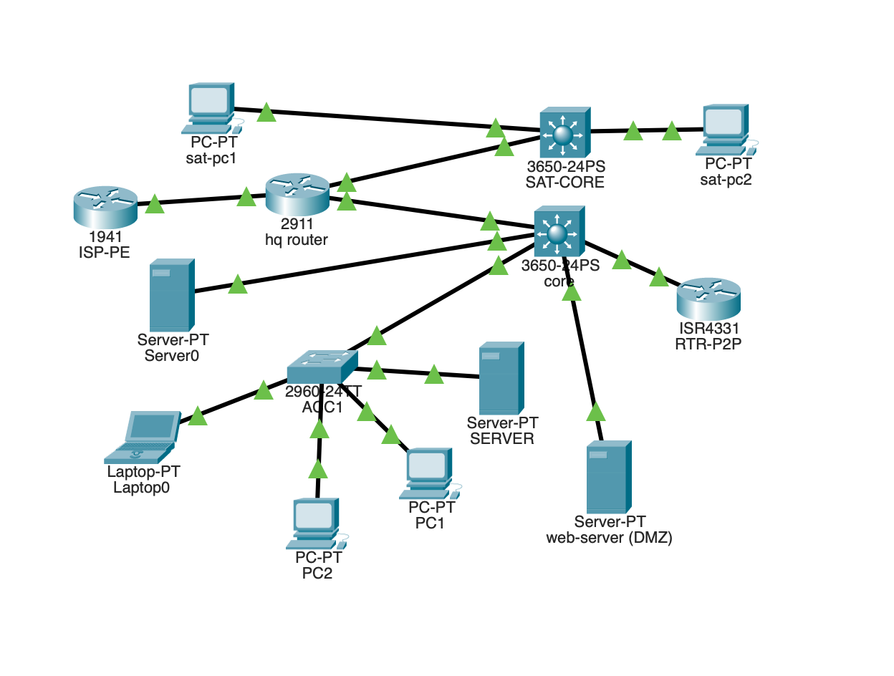
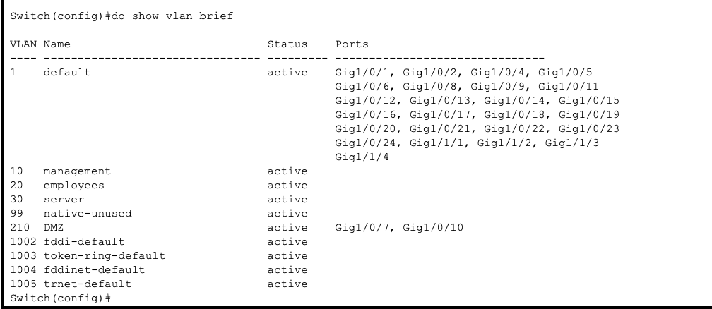
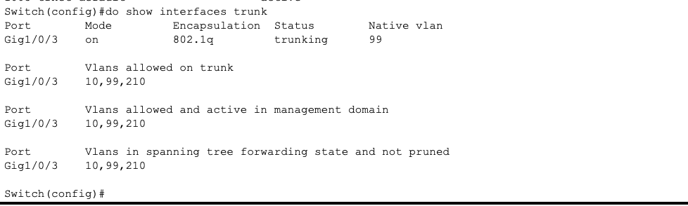
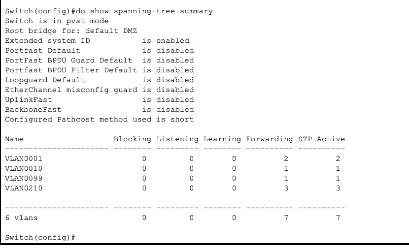
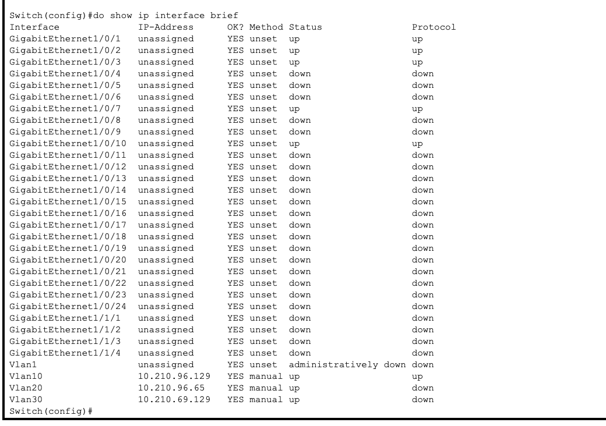
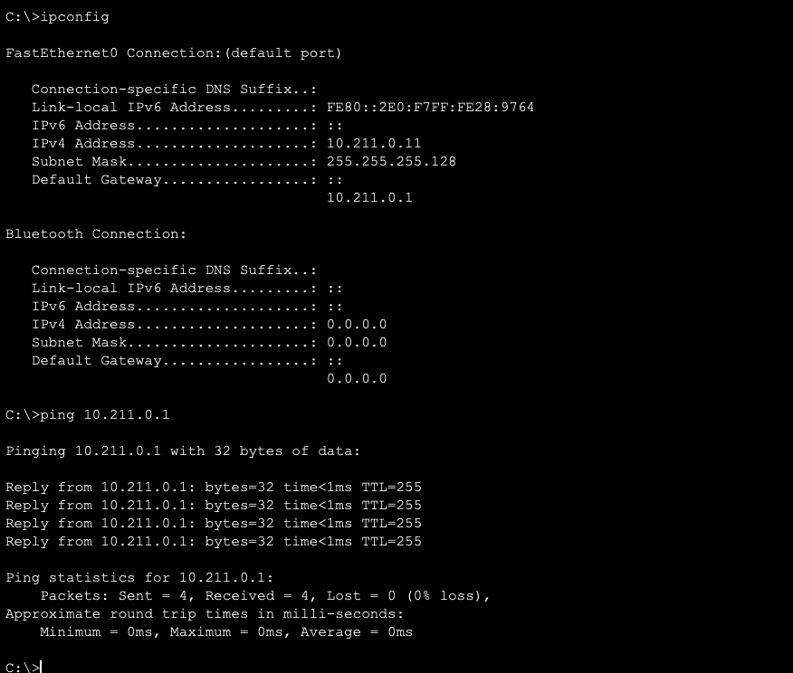

# Enterprise Network Security Lab

## Overview

This project documents the design, configuration, and security validation of a multi-site enterprise network built in Cisco Packet Tracer. The environment connects headquarters, satellite, DMZ, remote-access, and ISP segments while applying routing, segmentation, access control, VPN, and Layer 2 security controls.

## Project Objectives

- Segment departments using VLANs and separate IP networks
- Route internal traffic with OSPF
- Restrict traffic using extended access control lists
- Provide internet access through NAT/PAT
- Establish an IPsec site-to-site VPN
- Protect switch ports against common Layer 2 attacks
- Centralize infrastructure logging and monitoring
- Test connectivity and confirm security controls

## Network Architecture

The lab includes:

- Headquarters network
- Satellite location
- DMZ containing public-facing services
- Cisco ASA firewall
- ISP connection
- Remote network
- Multiple departmental VLANs
- Centralized NTP, Syslog, and SNMP services

## Technologies and Security Controls

| Category | Technologies |
|---|---|
| Routing | OSPF, static and default routes |
| Segmentation | VLANs, trunking, inter-VLAN routing |
| Traffic Control | Standard and extended ACLs |
| Perimeter Security | Cisco ASA, inside/outside/DMZ interfaces |
| Address Translation | Static NAT, dynamic NAT, PAT |
| Secure Connectivity | IPsec site-to-site VPN |
| Layer 2 Security | DHCP snooping, PortFast, BPDU Guard, Root Guard |
| Authentication | AAA, RADIUS, TACACS+ |
| Monitoring | Syslog, SNMP, NTP |
| Addressing | IPv4 and IPv6 |

## IP Addressing

The design uses the following primary address spaces:

- Internal network: `10.210.96.0/24`
- DMZ network: `10.210.210.0/24`
- IPv6 allocation: `/56`
- ASA outside interface: Address assigned through DHCP

Departmental networks were separated into VLANs to reduce broadcast domains and limit unauthorized lateral movement.

## VLAN Segmentation

The network uses dedicated VLANs for separate users, systems, and operational functions.

- VLAN 10
- VLAN 20
- VLAN 30
- Management and infrastructure segments
- DMZ segment for externally accessible services

Trunk links transport multiple VLANs between switches and routing devices. Access ports are assigned according to device function and department.

## Routing

OSPF provides dynamic routing between the headquarters, satellite, and remote networks. Neighbor relationships and routing tables were verified to confirm that authorized networks were advertised and reachable.

Default routing directs external traffic toward the ASA firewall and ISP connection.

## Access Control Lists

ACLs enforce traffic restrictions between internal networks and at the internet boundary.

The rules were designed to:

- Permit required business traffic
- Restrict unauthorized inter-VLAN access
- Protect management interfaces
- Control inbound internet traffic
- Limit access to DMZ resources
- Allow only approved services and protocols

## NAT and PAT

The ASA firewall provides address translation for internal systems.

- PAT allows multiple internal hosts to share an outside address
- Static NAT supports approved DMZ services
- NAT behavior was verified through connectivity testing and translation-table review

## IPsec Site-to-Site VPN

An IPsec VPN securely connects remote network segments across the simulated public network.

The configuration includes:

- Interesting-traffic ACLs
- IKE policy
- Pre-shared authentication
- IPsec transform set
- Crypto map
- Inside and outside interface assignments

Encrypted connectivity was tested between hosts at separate sites.

## Layer 2 Security

The switching infrastructure includes:

- DHCP snooping
- Trusted uplink configuration
- PortFast on approved access ports
- BPDU Guard
- Root Guard
- Secure trunk configuration
- Shutdown of unused switch ports

These controls help reduce the risk of rogue DHCP servers, spanning-tree manipulation, and unauthorized network access.

## Monitoring and Management

The lab uses centralized services to improve visibility and administration:

- Syslog for infrastructure event collection
- SNMP for device monitoring
- NTP for consistent timestamps
- AAA for centralized administrative authentication
- RADIUS and TACACS+ for controlled device access

## Validation

The completed environment was tested by:

- Verifying VLAN membership and trunk status
- Reviewing OSPF neighbors and learned routes
- Testing permitted and denied traffic
- Confirming NAT/PAT translations
- Testing access to DMZ services
- Validating IPsec VPN connectivity
- Reviewing spanning-tree protection
- Confirming DHCP snooping status
- Testing IPv4 and IPv6 connectivity
- Reviewing Syslog and monitoring output

## Skills Demonstrated

- Enterprise network design
- Cisco router and switch configuration
- Firewall administration
- Network segmentation
- Dynamic routing
- Access-control implementation
- VPN configuration
- Layer 2 attack mitigation
- Network troubleshooting
- Security validation
- Technical documentation

## Evidence

## Lab Evidence

### 1. Enterprise Network Topology

The Packet Tracer topology includes headquarters, satellite, ISP, server, DMZ, access-layer, and core-network components.

### 2. VLAN Segmentation

The core switch separates management, employee, server, native/unused, and DMZ traffic using VLANs 10, 20, 30, 99, and 210.

### 3. 802.1Q Trunk Validation

Interface GigabitEthernet1/0/3 operates as an 802.1Q trunk with VLAN 99 configured as the native VLAN. VLANs 10, 99, and 210 are allowed and forwarding.

### 4. Spanning Tree Validation

The core switch uses Per-VLAN Spanning Tree and operates as the root bridge for the default and DMZ spanning-tree instances. All active STP ports shown are in the forwarding state.

### 5. Layer 3 SVI Configuration

Switched virtual interfaces are configured for the management, employee, and server VLANs. VLAN 10 is operational with an active Layer 3 interface.

### 6. Satellite Gateway Connectivity

The satellite endpoint uses IPv4 address `10.211.0.11/25` with gateway `10.211.0.1`. Four successful ICMP replies confirm local gateway connectivity with zero packet loss.

## Security Notice

This project was completed in an authorized lab environment. The configurations, addresses, credentials, and systems shown are simulated and do not represent a production organization.
